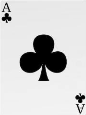

# Planning

The task I was assigned with for this project, was to create a game. This could be any of the following: 
* Tic Tac Toe (version of noughts and crosses)
* Rock Paper Scissors 
* Matching card game

I chose to create a matching card game. I plan to include this game on my home page of my website, for users to play when they come across it. The game will consist of 12 cards that are aligned in a 4 x 3 grid formation. 

Initially these cards will be laid face down, meaning that the back face of the card will need to be on display. The front face of the card will be revealed when the user clicks on the card by simply flipping over. The aim is to find a matching pair in the grid. If the cards there isn’t a match then both cards will flip back to display the back side of the card. If there is a match then the cards remain flipped and the user searches for another matching pair in the grid so and a so forth. Once we have found every matching pair in the grid in other words every card is flipped we the game ends. If the user refreshes the browser, the cards will be shuffled. 

Instead of creating something basic such as find the matching colours in the grid, I will browse the internet for images a popular card game. I have in mind a set of cards from a deck that contain Kings, Queens, Ace of Hearts, Ace of Spades, Ace of Clubs, Ace of Diamonds. These are six cards but if we created a duplicate pair then we will have 12 in total. I will also need a classic pattern used for a deck of cards. 

# Building

I started by creating a container for my cards using a 
 and give it a class name of "container". Within this container, I need to construct some three rows containing 4 cards. These rows will also be built using a 
 and are identified using a class called "row". I can then construct my cards again using a 
 referenced as "matching-card". Within each card I will place an image using the  tag. There are two of these, one for the front-face of the card, and another for the back-face of the card. As there are two, I will use a class to refer to the different faces. Let’s use `"front"` for the front-face, and `"back"` for the back-face. Now I can simply add my card faces to the `` tag using the `<src>` attribute and use the alt attribute to describe what the image is. For every `"matching-card"` class I need to use a `data-framework` to give that card a name. This will become very useful for the browser to determine which is a match or not. This is how each row should be constructed.

    

        

          

            
            
          

          

            
            
          

          

            
            
          

          

            
            
          

        

        .....
    

I will now create a css file for displaying the container and cards. For the container I will use a `height` of `516px` and a `width` of `500px`. This container will align the items to stretch both horizontally and vertically. This will mean that the containers contents should adjust in size automatically depending the view-port width. If we move onto the rows we want to make sure the they flex when the containers width and height adjusts. I will also need to prevent the grid from flexing, meaning that the grid remains 4x3. This is achieved by setting the `flex-flow` property to `flex nowrap`. Each item within the row will also need to stretch so I need to set the align-items property to stretch. 

With the flex property I can write it in different ways. I can write this property with a short-hand version: `flex: 1 0 100%`. This tells the element that I want it to expand to 100% of it can possibly expand to within the container. I don’t want the element to shrink but remains 100% of the width of the container. 

Now I have built the container and rows, I now need to build the cards for each row to form a grid. I can target all the first matching-card classes by using a child combinator. These are a direct descendant of the parent element row. Again I will apply the short-hand flex property to but this time I want it to grow and shrink with the size of the container `flex: 1 1 auto;`. The `basis` being set to `auto` will allow the cards to flex by growing and shrinking automatically to its ancestor element. 

    .container{
      border: none;
      resize: both;
      overflow: hidden;
      height: 516px;
      width: 500px;
      padding: 15px;
      display: flex;
      flex-flow: row wrap;
      align-items: stretch;
      margin: 0px auto;
      perspective: 1000px;
      background-color: rgba(241, 229, 229, 0.842);
      font-family: Arial, Helvetica, sans-serif;
    }

    .row{
      flex: 1 0 100%;
      display: flex;
      flex-flow: row nowrap;
      align-items: stretch;
    }

    .row  > * {
      border: 1px solid red;
      flex: 1 1 auto;
    }

All I need to do now is place the `matching-card` classes in each individual cell in the grid. This will give the images a container so they don’t overflow outside of them. I gave each `matching-card` a height of `170px` and a width of `0px`. I can then apply the `font` and `back` classes of the `` tags to the cells.

    .matching-card {
      background: grey;
      height: 170px;
      width: 0px; 
      position: relative;
      cursor: pointer;
      transform: scale(1);
      transform-style: preserve-3d;
      transition: transform .5s;
    }

    .front, .back{
      width: 100%;
      height: 100%;
      position: absolute;
      backface-visibility: hidden;
    }

Both the front and back classes will respect the width of its parent. They will also need to know they should be positioned relative to its container. I used the property `position:relative` for the `"matching-card"` class and `postion:absolute` for the `"front"` and `"back"` classes.

Now the grid has been constructed, I need to add several things before I move into creating a `JavaScript` file. I need to tell the cards to flip when they are clicked. Most of this is done through `js` but I need to tell the front face of the card to rotate when the user clicks the card. Here I will assign the property to transform and rotate `180 degrees` on its `Y axis`. This wont flip the card, a separate function in the `js` file will instruct the card to do this. I am assigning this property so the browser will know the font face needs to be `transformed` `180 degrees` when executed. I need to create a 3D effect to the rotation of this card. I need to have a click effect, every time a card in the grid is clicked. I have used a pseudo-class called active and assigned that the matching-card class in css. First, I have applied a `transform scale` of `97%` of the cards size. This means that the card will set back to the background once clicked. I applied a transition to this to make it run smoother, but this will only work if I specify the scale for it to work of in the `matching-card` selector. To the container, I need to add some depth giving it a 3D effect when the card is flipped. This is achieved by adding the `prospective` property and I used `1000px` as the property value. Then applying `transform-style` property to the `matching-card` element I can then apply `preserve-3d` which creates a 3D space to the container. The 3D effect isn’t visible until I add a `transition` property to the `matching-card`. Once I assign the `blackface-visibility` to `hidden` for the `font` and `back` class, I can then apply the `transform` property to the front class and tell it to rotate on its `Y` axis by `180 deg`. This will reveal the `back-face` and `front-face` of the cards when they are flipped.   

    .front, .back{
      width: 100%;
      height: 100%;
      position: absolute;
      backface-visibility: hidden;
    }

    .front{
      transform: rotateY(180deg);
    }

    .matching-card:active {
      transform: scale(0.97);
      transition: transform .2s;
    }

For the most important part of this game, I need to tell the browser that the cards need to be flipped when they are clicked. I created a js file, and created a const variable called cards. This variable gets every `matching-card` element from the `html` file through `querySelectorAll('.matching-card')` function. Now every element containing the class `"matching-card"` has been selected and assigned to this variable cards, I can start to build the `flipCard()` function for flipping the cards. 

For every card that is clicked I need the function to refer to the class I created in the css file `".flip"` which has the proeprty `transform: rotateY(180deg)`. I can easily refer to the card by applying the keyword `this` representing the card or object that was clicked, and accessing the class list of the `"matching-card"` and toggle the class `".flip"`. The keyword `toggle` will simply apply the class `.flip` to the `matching-card` that was clicked. When you click the card again `toggle` will remove the class. 

    

    .....
    

For each card I needed to assign an event listener. This event listener triggers the `flipCard()` function. This is easily achieved through the variable cards. By assigning an event listener for each card, it knows to listen for a `click` and execute the function `flipCard()`. 

    const cards = document.querySelectorAll('.matching-card');

    function flipCards(){
      this.classList.toggle('flip');
    }

    cards.forEach(card => card.addEventListener('click', flipCard));

 I will fix my css file and create a selector that includes a flip class for the `matching-card`. Assign the `transform: rotateY(180deg)` on the card, and it will apply the flip to the `matching-card` like the initial flip class I created. 

    .matching-card.flip{
      transform: rotateY(180deg);
    } 

In the JavaScript file I need to determine whether the a card has been flipped. I can do this by creating a variable called `hasFlipped` and give it a variable of false, as initially the value will be false because no card has been flipped. I can then create two variables `firstCard` and `secondCard`. 

    let hasFlippedCard = false;
    let firstCard, secondCard;

Within the `flipCard()` function I have created an if statement. This will determine whether the card has been flipped or not. 

    function flipCards(){
      this.classList.toggle('flip');

      if(!hasFlippedCard){
        hasFlippedCard = true;
        firstCard = this;

        return;
      }
      hasFlippedCard = false;
      secondCard = this;

      checkForMatch();
      }
    }

The statement reads that if the `hasFliipedCard` variable a false value which is true, then we want the variable to be updated to true, and then apply the `flip` class to the matching-card. If `hasFlippedCard` equal to true, then the user is clicking on the secondCard. The true condition for this if statement will update the `hasFlippedCard` variable to false, and then apply the flip class to the `secondCard`. 

Once I have determined that both cards have been clicked, I now need to check that they match. I used an attribute in html called `data-framework` which allows me to give a name the cards so the browser can determine whether the cards are identical or not. 

* The Queen = "queen"
* The King = "king"
* Ace of hearts = "hearts"
* Ace of spades = "spades"
* Ace of clubs = "clubs"
* Ace of diamonds = "diamonds"

For this I used a function called `checkForMatch()`. This would be executed within the `flipCard()` function. The function `checkForMatch()` runs a basic if function called an ternary operator. When we have a match between two cards we want to remove the event listener for those cards using `disableCards()`. This will be the true condition for identical cards. If the cards don’t match we will execute a separate function called `unflipCards()`. To un-flip the cards I have used a function that will remove the class `flip` from the  both `firstCard`, and `secondCard`. This function also contains a `setTimeout()` function that allows the user to see for themselves that the cards match or not, before being un-flipped. 

    function checkForMatch() {
      let isMatch = firstCard.dataset.framework === 
      secondCard.dataset.framework;
      isMatch ? disableCards() : unflipCards();
    }

    function disableCards() {
      firstCard.removeEventListener('click', flipCard);
      secondCard.removeEventListener('click', flipCard);
    }

    function unflipCards() {
      lockBoard = true;
      setTimeout(()=> {
        firstCard.classList.remove('flip');
        secondCard.classList.remove('flip');

        resetBoard();
      }, 1500);
    }

The board needs to be locked if the cards don’t match. For that reason I have created a `lockBoard` variable that has an initial value of `false` outside of the function `unflipCards()`. An if statement is placed in the `flipCard()` function. If value of `lockBoard` is `true`, we will simply return from this function meaning the following code isn't executed. The board will be unlocked once the cards are un-flipped in the `unflipCards()` function.  

    function flipCard() {
      if(lockBoard) return;
      if(this === firstCard) return;

      this.classList.add('flip'); 

      if(!hasFlippedCard){
        hasFlippedCard = true;
        firstCard = this;
        return;
    } 

    hasFlippedCard = false;
    secondCard = this;

    checkForMatch();
    }

If the user were to double click on a card, the match will become true and it will remove the event listener and the card will remain flipped. To get around this, I have used an `if` condition at the beginning of the `flipCard()` function. If the `firstCard` has been clicked, then the this variable will store the `firstCard`. The `firstCard` variable is not set, meaning the condition is false and the function is executed normally. If the second card is clicked then the this variable holds the secondCard and in case that is  exactly equal to the first card, it returns from the function. 

For this condition to work, both the `firstCard` and `secondCard` variables need to be set to `null`. I have created a function called `resetBoard()`. This function will set `hasFlippedCard` and `lockBoard` to `false`, and the `firstCard` and `secondCard` to `null`. I can include this function `resetBoard()` in the `unflipCards()` function. 

    function resetBoard(){
      [hasFlippedCard, lockBoard] = [false, false];
      [firstCard, secondCard] = [null, null];
    }

When the user refreshes the browser, I want the cards to be reshuffled. Flex box has a flex-items property called `order` which has a default value of `0`. By assigning an alternative value to the order property, the items will be re-arranged in ascending order. The idea is to give each card a random value between 1 and 11, and place arrange them in order. 

I have created a `shuffle()` function. This function will create a random number for that card using the `Math.random()` function. To get a number between 0 and 11, I need to multiple that random number by 12.....`Math.random() * 12`. This returns a decimal value therefore I need to enclose this function within the `Math.floor()` function to return an integer. I can now apply the random number to store in the variable `randomPos` to the order property of the `matching-card`. This function performs as a loop to apply a value for each card. For this function to be executed immediately, I used an Immediately Invoked Function Expression, so it can be executed straight away.  

    (function shuffle() {
      cards.forEach(card => {
      let randomPos = Math.floor(Math.random() * 12);
      card.style.order = randomPos;
      });
    })();

# Debugging

This task was not easy. From what I have learnt so far, I was able to create a container and assemble some cards using `
` elements. The problem I had was to get my game to initially get the game to shrink within my home page. The container would just run of the page. After doing some research online, I found an article on stackoverflow that recommended creating a grid rather than a flex box. Once I had created I was able to achieve what I needed placing the images within each grid in the container. 

Once I had created the grid, I needed the front-face of the card and back-face to line-up with the parent class matching-card, this was corrected using `position: relative` for the parent class and `position: obsolute` for the child classes. 

Initially I tested the flipping from a different online tutorial with colours. I came across an error where the card would not flip, eventually realising that I had the backface-visibility on both the front and back set to visible. Setting it to hidden solved the problem. 

I initially tested an idea of creating an array of colours and applying them to the cards in js using `change.style.background:` `"red"` or `"blue"` for each card. I then realised that if I put this array of colours into a loop, I could assign a random colour in the array to the card each time and shuffle the order of the colours in the array so every time a card needed a colour I could assign a random colour from the array by picking the first one in the list that had been shuffled.  

Eventually I wanted to come up with a better game and found an online tutorial that demonstrated how a memory card game works. I was able to use this tutorial and adapt that to my game. Some of the errors I came across, were that the cards kept on flipping back to the back-face. This was down to a simple error, the `data-framework` attribute had a letter in Upper case and the matching card had the name in lower case. Of course this wouldn’t match as both values appear as differently meaning no match was found but logically there was a match. 

